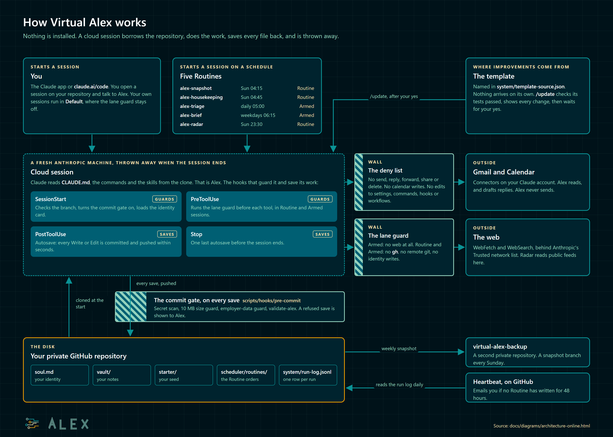

# How Virtual Alex works

Virtual Alex is the Alex Kit running inside Claude Code's cloud sessions. Nothing is installed on
any device. A private GitHub repository holds everything, and each session borrows it, works, and
saves back to it.

The source of this picture is [diagrams/architecture-online.html](diagrams/architecture-online.html).

## The repository is the disk

The owner's private repository is the only thing that lasts. It holds the rules (`CLAUDE.md`), the
commands, the skills and scripts, and the owner's own files: `soul.md` (who they are and how they
write), `vault/` (their notes), `starter/` (the seed they were given) and `system/run-log.jsonl`
(one row per scheduled run). If it is not in the repository, it is gone when the session ends.

## A session, start to finish

1. **Something starts a session.** The owner opens one in the Claude app or at `claude.ai/code`,
   or a Routine starts one on its schedule. Either way Anthropic builds a fresh machine and clones
   the repository onto it.
2. **SessionStart runs.** It moves the session onto the repository's real `main` branch
   (`scripts/lib/session-branch.sh`), switches the commit gate on, and loads the owner's identity
   card. Claude reads `CLAUDE.md`, the commands and the skills. From here on, Claude is Alex.
3. **Alex works.** Before each tool call in a Routine session, the lane guard checks the call
   (`scripts/untrusted-lane-guard.js`). The owner's own sessions skip it.
4. **Every file write is saved.** After each Write or Edit, `scripts/autosave.sh` commits and
   pushes. The save does not depend on Alex remembering to do it. A save the commit gate refuses
   is reported to Alex in the same turn.
5. **Stop runs a last save,** rebases on anything that landed meanwhile, and reads the push back.
   Then the machine is thrown away.

## The five Routines

A Routine is a saved form on the owner's claude.ai account that starts a session at a set time.
Its prompt is one line: read `scheduler/routines/<name>.md` and carry it out. The file is the
order, and it lives in the repository, where the checks can see it.

| Routine | When | Environment | What it does |
|---|---|---|---|
| `alex-snapshot` | Sunday 04:15 | Routine | copies the repository to the backup repository |
| `alex-housekeeping` | Sunday 04:45 | Routine | the weekly checks, a monthly self-review, the synced skills list |
| `alex-triage` | daily 05:00 | Armed | sorts new mail and drafts replies |
| `alex-brief` | weekdays 06:15 | Armed | the morning brief |
| `alex-radar` | Sunday 23:30 | Routine | reads the owner's chosen feeds |

`docs/ROUTINES-FORMS.md` has every field of every form. The two Armed Routines read mail, which
strangers write, so their environment switches the lane guard to its strictest setting.

## The walls

Three layers stand between Alex and the outside world, and a fourth keeps a Routine from
rewriting the rules:

- **The deny list** in `.claude/settings.json`: Alex cannot send, reply, forward, share or delete
  through a connector, cannot write to the calendar, and cannot edit its own settings, commands,
  hooks or workflows.
- **The lane guard**, in Routine and Armed sessions: no `gh`, no remote git, no web addresses in
  shell commands except the machine itself. Armed sessions also lose the web tools.
- **The commit gate** on every save: a secret scan, a 10 MB size limit, the employer-data guard and
  the repository's own validator.
- **The identity restore**: a Routine that changes `soul.md` or another identity file has the
  change undone before its save.

What each wall stops, and how to report a problem, is in [SECURITY.md](../SECURITY.md).

## Getting updates

Improvements are made in the Kit and published to the template repository this one was made from.
`system/template-source.json` names it: the build writes that file into every tree, and `/update`
reads the address from there and never from memory. Nothing reaches an owner's repository on its
own, and no Routine can tell whether an update is waiting, because a Routine sees one repository and
the template is a second. On the first Monday of each month the brief reminds the owner instead. The
owner runs `/update`, which applies only a template head whose own CI finished green, lists every
change and the sensitive files it touches, waits for a yes, and applies the change as one commit by
the owner. It never touches `soul.md`, `vault/`, `starter/` or the owner's settings. `CHANGELOG.md`
lists every template build.

## Three watchers

- **The Heartbeat**, a GitHub Actions workflow, runs daily on GitHub's side and emails the owner
  when no Routine has written to the run log for 48 hours. It is the one alarm that works when
  Alex does not.
- **The weekly sweep** (`work/18-recovery-layer/check.mjs`, inside housekeeping) flags a Routine
  with no run inside its schedule.
- **`/alex-status`** prints the identity line and the newest run of each Routine.

## What the laptop version has and this one does not

A local scheduler, an Obsidian vault, and an encrypted backup outside the owner's GitHub account.
Here the Routines are the scheduler, the notes are read on github.com, and the monthly ZIP download
is the only copy outside GitHub. `docs/ARCHITECTURE.md` describes the laptop version.
